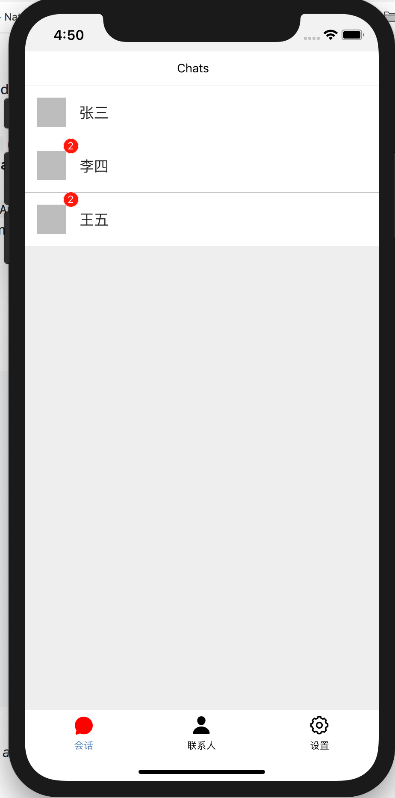

# react-native-chat
react-native-chat

# 运行

```shell script
{
    "android": "react-native run-android",
    "ios": "react-native run-ios",
    "start": "react-native start",
    "test": "jest",
    "lint": "eslint ."
}
```

# 采用的技术

- react
- react-native
- redux
- react-navigation


# 业务截图

</img>

</img>

</img>


